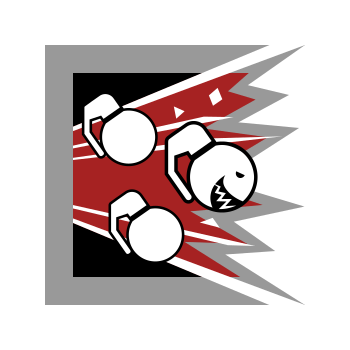

# R6 Operators Icons

[](https://github.com/TG-Twilight/R6-Operators-Icons/stargazers)
[](./LICENSE)

A simple API and static asset library that provides SVG icons for all Rainbow Six: Siege operators, suitable for web, bots, and creative projects.

---

## Features

- ⚡ **Simple API**: Get any operator icon as SVG by URL.
- 🧩 **Batch Combine**: Combine multiple icons into a single SVG sprite.
- 🎨 **Radius Customization**: Set border radius for rounded corners.
- 📦 **Self-hosted**: No external dependency required.
- 🌏 **Multilingual**: Docs available in English and Chinese.

---

## Usage

### 1. Get a single operator SVG

```url
GET /icons?i=fuze
```

Example: 
<p> 

  
</p>

---

### 2. Combine multiple icons in one SVG

```url
GET /icons?i=ash,bandit,ace
```

---

### 3. Customize icons per row and corner radius

```url
GET /icons?i=ash,bandit,ace&perline=2&radius=16
```

- `perline`: Number of icons per row (default: 15, max: 15)
- `radius`: Border radius for icon backgrounds (0~100, default: 25)

---

### 4. Get all available operator IDs

```url
GET /icons
```

Returns a JSON list of all operator IDs.

---

## Examples

### Attacker Example (each icon 96×96)

[https://r6-operators-icons.vercel.app/api/icons?i=recruit_blue,fuze,buck,blitz,montagne,nokk,ash](https://r6-operators-icons.vercel.app/api/icons?i=recruit_blue,fuze,buck,blitz,montagne,nokk,ash)

<p>
  
</p>

### Defender Example (each icon 96×96)

[https://r6-operators-icons.vercel.app/api/icons?i=rrecruit_red,rook,kapkan,mute,smoke,jager,azami](https://r6-operators-icons.vercel.app/api/icons?i=recruit_red,rook,kapkan,mute,smoke,jager,azami)

<p>
  
</p>

---

## Self-host

Clone and run:

```bash
git clone https://github.com/TG-Twilight/R6-Operators-Icons.git
cd R6-Operators-Icons
npm install
npm run build
npm start
```

API will be available at `http://localhost:3000/icons?...`

---

## Directory Structure

```
/icons/         // All SVG files (one per operator)
/src/           // Source code (TypeScript)
/src/utils/     // SVG combination logic
/src/routes/    // Express API routes
```

---

## Credits

- Operator icons are taken from [@marcopixel/r6operators-website](https://github.com/marcopixel/r6operators-website)
- Made a lot of modifications, but inspired by [@syvixor/skills-icons](https://github.com/syvixor/skills-icons)

---

## LICENSE

MIT License © 2025-present [TG-Twilight](https://github.com/TG-Twilight)

---

## 中文文档

See [`README_zh-CN.md`](./src/README_zh-CN.md)
